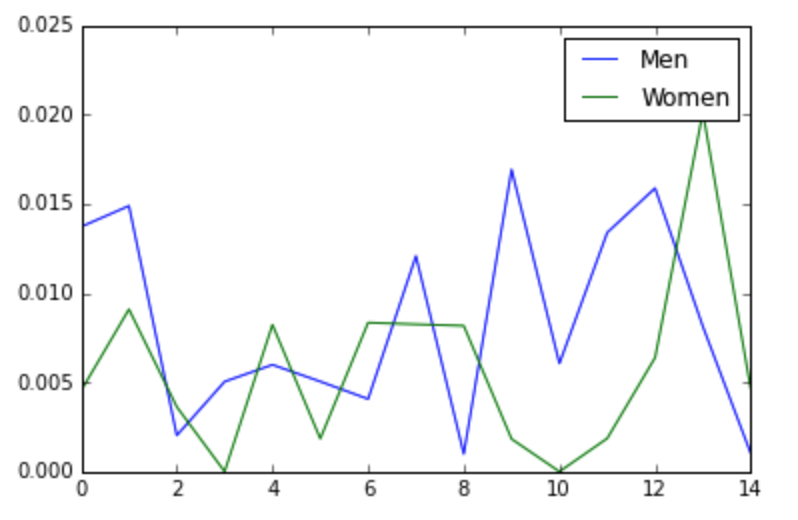

# Crazy stuff I've found in my own code

It's always good to not take yourself too seriously, so I decided to go back through [one of my projects from five years ago](https://github.com/tjwaterman99/IAAF-Stats) and find some of the crazy things I did, just for kicks.

To be clear: this was a project that I was incredibly proud of. I remember wanting to put something on my public Github profile that really "showed off" what I could do. I still think publishing some work is a good thing, but at the time I probably thought that what I put on my Github profile mattered more than it actually does.

The old project that I chose to go through is a collection of iPython notebooks that could scrape the results of the IAAF Track & Field world championship races from [the IAAF website](https://www.worldathletics.org/), and also run some analysis on the results. 

This was a topic close to my heart, since I had been running track for eight years through high school and college.

But man, what was I thinking?!

## Naming variables with a single letter

To be fair, I've seen this hundreds of times even from engineers paid ridiculously high salaries. But it's always a terrible idea, no matter who does it.

```py
def get_margin(g): 
    """Logic to extract the winning margin from a dataframe of 
    the first and second place results in a race.
    
    Accepts a pandas.DataFrame.groupby object."""

    ...
```

In my defense, at least I chose the letter `g`, which is the first letter of the type of object the function accepts. That shows I was aware using the variable name `x` would have been less helpful, and I chose not to be as unhelpful as possible.

## Hardcoding resource locations

```py
df = pd.read_csv('/Users/tom/Projects/IAAF-Stats/Scripts/IAAF_Results.csv')
```

The idea that someone else would want to run my code on a computer that wasn't my laptop must have been surprising to me.

## Defining functions within other functions

I would like to think this was just an accident in my indentation, but it happens three times in a row in a single function.

```python
def parse_web_page(page_name):

    def get_athlete_details(athlete):
        ...

    def get_mark_details(mark):
        ...

    def get_country_details(country):
        ...
    
    page = bs(open(page_name))

    ...
```

At the time, I must have thought there was a reason to "hide" the inner functions, but I have no idea what I was thinking.

## TODOs that will never be done

```
# To do: plotting
```

We all have good intentions. But I have never, ever, ever seen someone fix a `TODO`. My TODOs from that project are 5 years old, so it's safe to say they won't be the exception.

## Graphs that don't really make any sense



This isn't really a _code_ issue, exactly, but it's still funny. 

I think what the chart above is trying to show is how close the 100m races at the IAAF championships have been, for both the men and women. But the only way to figure that out is to actually read the code that produced the graph (haha, good luck). 

The x-axis is the championship number, so "8" on the x-axis means the 8th championship since they started being held. It should probably have been "year" and "location", ie the number 0 on the x-axis should have been "Helsinki, Finland (1983)".

The y-axis shows the percent difference between the winner's time and the runner-up's time, so lines closer to 0 mean a closer race. The last race in the dataset was an extremely close race - the winner was about 0.1% faster than the runner up, which was just a few milliseconds.

## In conclusion, I digress

I wrote recently about how [we're usually exhausted just getting the thing to do the thing we want](/what-problems-should-be-hard), and we don't usually have the energy left for the simple questions, like "what are the units on the graph?", or "how will someone install this?" 

Looking back at my old code, I've realized that quality is often just about consistently avoiding game-ending mistakes, and I find that very encouraging. My work doesn't need to be great, it just needs to work.